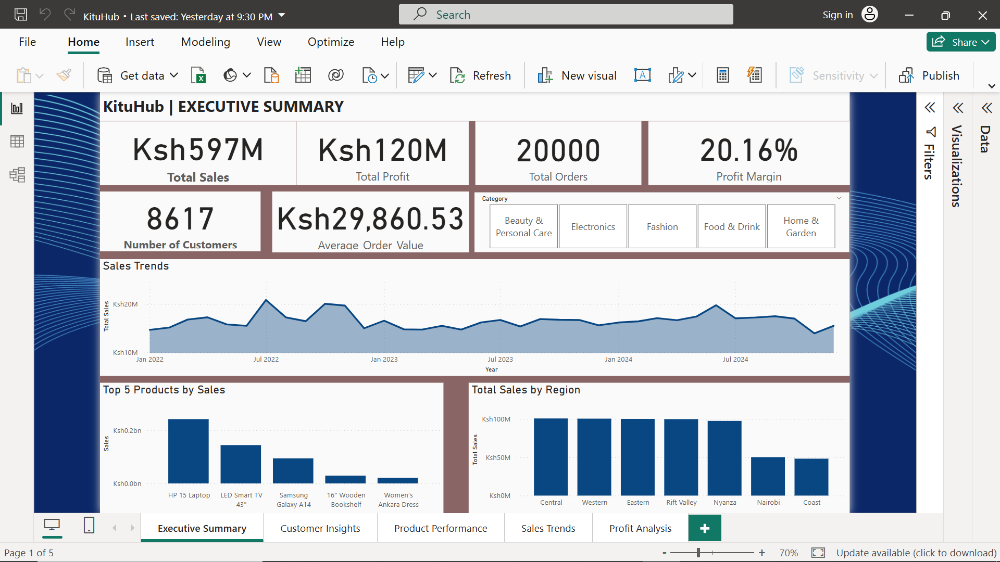
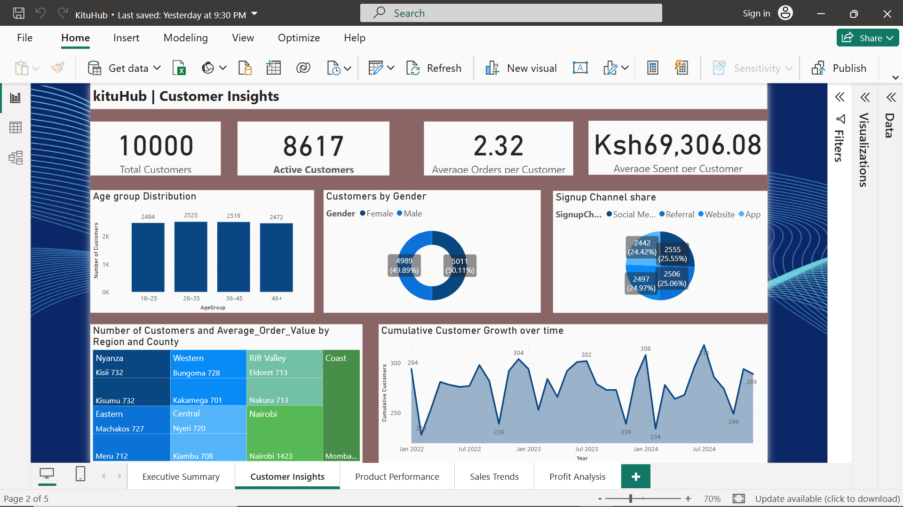
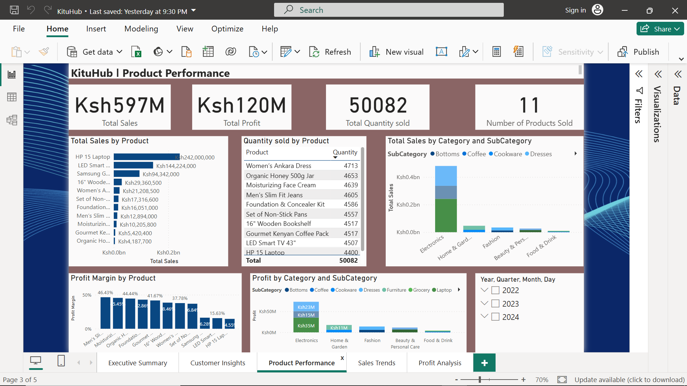
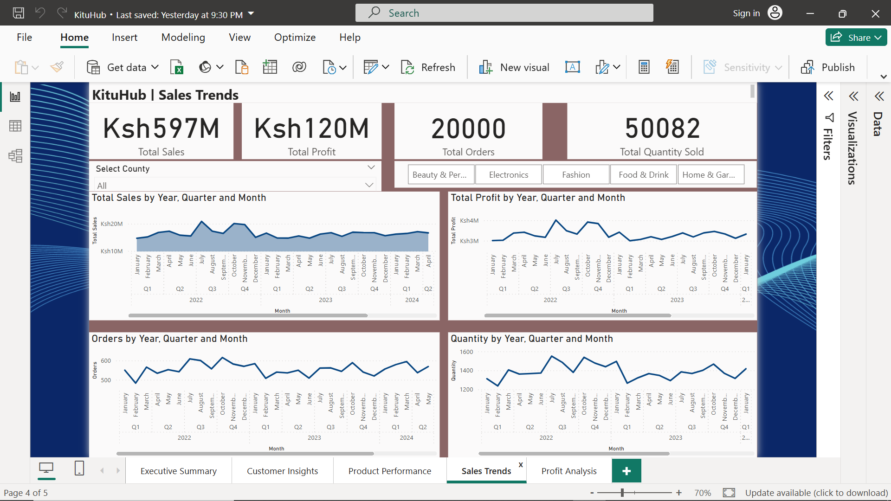
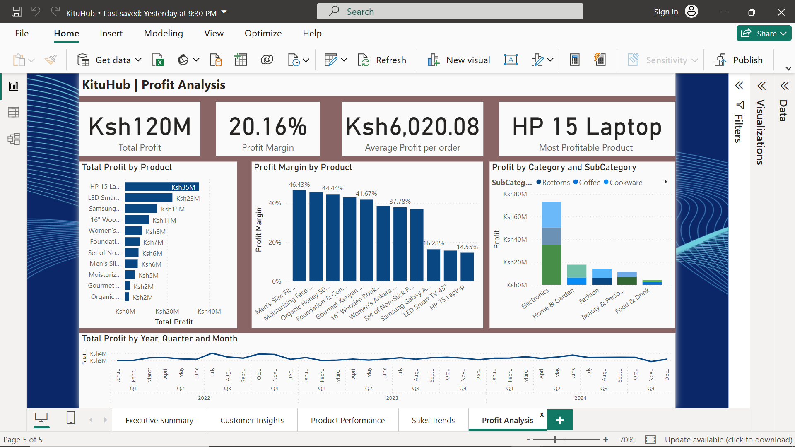

# 📊 KituHub E-Commerce Dashboard

A professional Power BI project simulating an e-commerce business in Kenya. This dashboard provides rich insights into sales, customer behavior, product performance, profitability, and more — designed for portfolio display and business storytelling.

---

## 🔍 Project Overview

**KituHub** is a fictional Kenyan e-commerce business created to demonstrate data modeling, storytelling, and dashboard design in Power BI. This project uses a fully synthetic dataset with 20,000 transactions across 10,000 customers over three years (2022–2024).

The dashboard delivers value across business functions:
- 📈 Executive-level KPIs and trends
- 👤 Customer segmentation and acquisition tracking
- 📦 Product performance and profitability
- 🕒 Time-based sales analysis
- 🗺️ Regional insights with delivery cost considerations

---

## 📁 Dashboard Pages

| Page | Description |
|------|-------------|
| **Executive Summary** | High-level KPIs, sales trends, top products, and regional breakdowns |
| **Customer Insights** | Demographic analysis, acquisition trends, signup channels, and growth |
| **Product Performance** | Sales, quantity sold, profit margin by product and category |
| **Sales Trends** | Monthly, quarterly sales trends and volume fluctuations |
| **Profit Analysis** | Deep dive into profit drivers, margin efficiency, and cost dynamics |

---

## 🛠️ Tools Used

- **Power BI Desktop**
- **DAX** for calculated measures and KPIs
- **Power Query** for data transformation
- **Custom JSON Theme** for styling and branding
- **Synthetic Data Generation** using Python and Excel

---

## 📊 Dataset Highlights

- 🧾 20,000 Orders
- 👥 10,000 Customers across 12 counties
- 🛒 11 Products across 5 categories
- 🚚 Delivery cost model based on distance from Nairobi
- 📅 Time range: Jan 2022 – Dec 2024

---

## 🎨 Design Features

- Custom branding and theme (`KituHub`)
- Interactive slicers and drill-downs
- KPI cards with dynamic DAX measures
- Clean layout optimized for professional presentation
- Fully responsive interactions between visuals

---

## 🖼️ Screenshots


### Executive Summary  


### Customer Insights  


### Product Performance  


### Sales Trends  


### Profit Analysis  


---

## 📂 Folder Structure

```bash
KituHub/
├── README.md
├── KituHub.pbix
├── KituHubTheme.json
├── /data
│   ├── sales.csv
│   ├── customers.csv
│   ├── products.csv
│   ├── delivery.csv
│   └── date.csv
├── /screenshots
│   ├── executive-summary.png
│   ├── customer-insights.png
│   ├── product-performance.png
│   ├── sales-trends.png
│   └── profit-analysis.png
```
---

## 🙋‍♂️ Author

**Victor Kioko Mutua**  
Bachelor of Science in Mathematics (University of Nairobi, 2025)  
[LinkedIn](https://www.linkedin.com/in/mutuavictor) • [Email](kiokovictor78@gmail.com)

---

## ✅ Status

✅ Project complete and published for portfolio showcase.  
🔄 Open to improvements and feedback.

---

